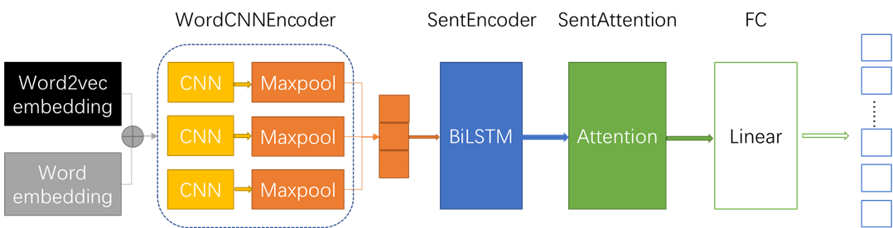

# Task4 基于深度学习的文本分类2.2-Word2Vec+TextCNN+BiLSTM+Attention分类

完整代码见：[NLP-hands-on/天池-零基础入门NLP at main · ifwind/NLP-hands-on (github.com)](https://github.com/ifwind/NLP-hands-on/tree/main/天池-零基础入门NLP/Word2Vec_TextCNN_BiLSTM_Attention)

## 模型架构

模型结构如下图所示，主要包括WordCNNEncoder、SentEncoder、SentAttention和FC模块。




最终需要做的是文档分类任务，从文档的角度出发，文档由多个句子序列组成，而句子序列由多个词组成，因此我们可以考虑**从词的embedding->获取句子的embedding->再获得文档的embedding->最后根据文档的embedding对文档分类**。

CNN模块常用于图像数据，[Convolutional Neural Networks for Sentence Classification](https://link.zhihu.com/?target=https%3A//arxiv.org/abs/1408.5882)等论文将CNN用于文本数据，如下图所示，值得注意的是，CNN的卷积核在文本数据上，卷积核的宽度和word embedding的维度相同。


**WordCNNEncoder**包括三个不同卷积核大小的CNN层和相应的三个max pooling层，用于对一个句子卷积，然后max pooling得到一个句子的embedding。

**SentEncoder**包括多个BiLSTM层，将一篇文档中的句子序列作为输入，得到一篇文档中各个句子的embedding。

**Attention**中输入的一篇文档中各个句子的embedding首先经过线性变化得到`key`，`query`是可学习的参数矩阵，`value`和`key`相同，得到每个句子embedding重要性加权的一篇文档的embedding。

每个batch由多个文档组成；文档由多个句子序列组成；句子序列由多个词组成。所以输入整体模型的batch形状为：batch_size, max_doc_len, max_sent_len；

- 输入wordCNNEncoder的batch形状为：batch_size * max_doc_len, max_sent_len（只输入词的id）；
  1. 利用word2vec embedding（固定）和随机初始化的权重（需要被训练）构建word embedding（二者相加）：batch_size * max_doc_len,1(添加的一个channel维度，方便做卷积), max_sent_len, word_embed_size；
  2. 分别经过卷积核为2、3、4的三个CNN层：batch_size * max_doc_len，sentence_len, hidden_size；
  3. 再分别经过三个相应的max pooling层：batch_size * max_doc_len，1, hidden_size；
  4. 拼接三个max pooling层的输出：batch_size * max_doc_len，1, 3*hidden_size(sent_rep_size)；
  5. 输出：batch_size * max_doc_len, sent_rep_size；

- 输入SentEncoder的batch形状为：batch_size, max_doc_len，sent_rep_size；
- 输入Attention的batch形状为：batch_size,  max_doc_len，2 * hidden_size of lstm；
- 输入FC的batch形状为：batch_size， 2*hidden。

### 模型代码

根据上述流程分析，模型代码就好理解了，各个模块的模型代码如下。

#### WordCNNEncoder

`WordCNNEncoder`包括两个`embedding`层，分别对应`batch_inputs1`，对应的embedding 层是可学习的，得到`word_embed`；`batch_inputs2`，读取的是外部训练好的词向量，这里用的是word2vec的词向量，是不可学习的，得到`extword_embed`。将 2 个词向量相加，得到最终的词向量`batch_embed`，形状是`(batch_size * doc_len, sent_len, 100)`，然后添加一个维度，变为`(batch_size * doc_len, 1, sent_len, 100)`，对应 Pytorch 里图像的`(B, C, H, W)`。

```python
class WordCNNEncoder(nn.Module):
    def __init__(self, log,vocab):
        super(WordCNNEncoder, self).__init__()
        self.log=log
        self.dropout = nn.Dropout(dropout)
        self.word_dims = 100 # 词向量的长度是 100 维
        # padding_idx 表示当取第 0 个词时，向量全为 0
        # 这个 Embedding 层是可学习的
        self.word_embed = nn.Embedding(vocab.word_size, self.word_dims, padding_idx=0)

        extword_embed = vocab.load_pretrained_embs(word2vec_path,save_word2vec_embed_path)
        extword_size, word_dims = extword_embed.shape
        self.log.logger.info("Load extword embed: words %d, dims %d." % (extword_size, word_dims))

        # # 这个 Embedding 层是不可学习的，通过requires_grad=False控制
        self.extword_embed = nn.Embedding(extword_size, word_dims, padding_idx=0)
        self.extword_embed.weight.data.copy_(torch.from_numpy(extword_embed))
        self.extword_embed.weight.requires_grad = False

        input_size = self.word_dims

        self.filter_sizes = [2, 3, 4]  # n-gram window
        self.out_channel = 100
        # 3 个卷积层，卷积核大小分别为 [2,100], [3,100], [4,100]
        self.convs = nn.ModuleList([nn.Conv2d(1, self.out_channel, (filter_size, input_size), bias=True)
                                    for filter_size in self.filter_sizes])

    def forward(self, word_ids, extword_ids):
        # word_ids: sentence_num * sentence_len
        # extword_ids: sentence_num * sentence_len
        # batch_masks: sentence_num * sentence_len
        sen_num, sent_len = word_ids.shape

        # word_embed: sentence_num * sentence_len * 100
        # 根据 index 取出词向量
        word_embed = self.word_embed(word_ids)
        extword_embed = self.extword_embed(extword_ids)
        batch_embed = word_embed + extword_embed

        if self.training:
            batch_embed = self.dropout(batch_embed)
        # batch_embed: sentence_num x 1 x sentence_len x 100
        # squeeze 是为了添加一个 channel 的维度，成为 B * C * H * W
        # 方便下面做 卷积
        batch_embed.unsqueeze_(1)

        pooled_outputs = []
        # 通过 3 个卷积核做 3 次卷积核池化
        for i in range(len(self.filter_sizes)):
            # 通过池化公式计算池化后的高度: o = (i-k)/s+1
            # 其中 o 表示输出的长度
            # k 表示卷积核大小
            # s 表示步长，这里为 1
            filter_height = sent_len - self.filter_sizes[i] + 1
            # conv：sentence_num * out_channel * filter_height * 1
            conv = self.convs[i](batch_embed)
            hidden = F.relu(conv)
            # 定义池化层：word->sentence
            mp = nn.MaxPool2d((filter_height, 1))  # (filter_height, filter_width)
            # pooled：sentence_num * out_channel * 1 * 1 -> sen_num * out_channel
            # 也可以通过 squeeze 来删除无用的维度
            pooled = mp(hidden).reshape(sen_num,
                                        self.out_channel)

            pooled_outputs.append(pooled)
        # 拼接 3 个池化后的向量
        # reps: sen_num * (3*out_channel)
        reps = torch.cat(pooled_outputs, dim=1)

        if self.training:
            reps = self.dropout(reps)

        return reps
```

#### SentEncoder

LSTM 的 hidden_size 为 256，由于是双向的，经过 LSTM 后的数据维度是`(batch_size , doc_len, 512)`，然后和 mask 按位置相乘，把没有单词的句子的位置改为 0，最后输出的数据`sent_hiddens`，维度依然是`(batch_size , doc_len, 512)`。

```python
sent_hidden_size = 256
sent_num_layers = 2

class SentEncoder(nn.Module):
    def __init__(self, sent_rep_size):
        super(SentEncoder, self).__init__()
        self.dropout = nn.Dropout(dropout)

        self.sent_lstm = nn.LSTM(
            input_size=sent_rep_size, # 每个句子经过 CNN（卷积+池化）后得到 300 维向量
            hidden_size=sent_hidden_size,# 输出的维度
            num_layers=sent_num_layers,
            batch_first=True,
            bidirectional=True
        )

    def forward(self, sent_reps, sent_masks):
        # sent_reps:  b * doc_len * sent_rep_size
        # sent_masks: b * doc_len
        # sent_hiddens:  b * doc_len * hidden*2
        # sent_hiddens:  batch, seq_len, num_directions * hidden_size
        # containing the output features (h_t) from the last layer of the LSTM, for each t.
        sent_hiddens, _ = self.sent_lstm(sent_reps)
        # 对应相乘，用到广播，是为了只保留有句子的位置的数值
        sent_hiddens = sent_hiddens * sent_masks.unsqueeze(2)

        if self.training:
            sent_hiddens = self.dropout(sent_hiddens)

        return sent_hiddens
```

#### Attention

`query`的维度是`512`，`key`和`query`相乘，得到`outputs`并经过`softmax`，维度是`(batch_size , doc_len)`，表示分配到每个句子的权重。使用`sent_masks`，把没有单词的句子的权重置为`-1e32`，得到`masked_attn_scores`。最后把`masked_attn_scores`和`key`相乘，得到`batch_outputs`，形状是`(batch_size, 512)`。

```python
class Attention(nn.Module):
    def __init__(self, hidden_size):
        super(Attention, self).__init__()
        self.weight = nn.Parameter(torch.Tensor(hidden_size, hidden_size))
        self.weight.data.normal_(mean=0.0, std=0.05)

        self.bias = nn.Parameter(torch.Tensor(hidden_size))
        b = np.zeros(hidden_size, dtype=np.float32)
        self.bias.data.copy_(torch.from_numpy(b))

        self.query = nn.Parameter(torch.Tensor(hidden_size))
        self.query.data.normal_(mean=0.0, std=0.05)

    def forward(self, batch_hidden, batch_masks):
        # batch_hidden: b * doc_len * hidden_size (2 * hidden_size of lstm)
        # batch_masks:  b x doc_len

        # linear
        # key： b * doc_len * hidden
        key = torch.matmul(batch_hidden, self.weight) + self.bias

        # compute attention
        # matmul 会进行广播
        #outputs: b * doc_len
        outputs = torch.matmul(key, self.query)
        # 1 - batch_masks 就是取反，把没有单词的句子置为 0
        # masked_fill 的作用是 在 为 1 的地方替换为 value: float(-1e32)
        masked_outputs = outputs.masked_fill((1 - batch_masks).bool(), float(-1e32))
        #attn_scores：b * doc_len
        attn_scores = F.softmax(masked_outputs, dim=1)

        # 对于全零向量，-1e32的结果为 1/len, -inf为nan, 额外补0
        masked_attn_scores = attn_scores.masked_fill((1 - batch_masks).bool(), 0.0)

        # sum weighted sources
        # masked_attn_scores.unsqueeze(1)：# b * 1 * doc_len
        # key：b * doc_len * hidden
        # batch_outputs：b * hidden
        batch_outputs = torch.bmm(masked_attn_scores.unsqueeze(1), key).squeeze(1)

        return batch_outputs, attn_scores
```

#### 完整模型

把 WordCNNEncoder、SentEncoder、Attention、FC 全部连接起来。

```python
class Model(nn.Module):
    def __init__(self,log, vocab):
        super(Model, self).__init__()
        self.log=log
        self.sent_rep_size = 300 # 经过 CNN 后得到的 300 维向量
        self.doc_rep_size = sent_hidden_size * 2 # lstm 最后输出的向量长度
        self.all_parameters = {}
        parameters = []
        self.word_encoder = WordCNNEncoder(log,vocab)

        parameters.extend(list(filter(lambda p: p.requires_grad, self.word_encoder.parameters())))

        self.sent_encoder = SentEncoder(self.sent_rep_size)
        self.sent_attention = Attention(self.doc_rep_size)
        parameters.extend(list(filter(lambda p: p.requires_grad, self.sent_encoder.parameters())))
        parameters.extend(list(filter(lambda p: p.requires_grad, self.sent_attention.parameters())))
        # doc_rep_size
        self.out = nn.Linear(self.doc_rep_size, vocab.label_size, bias=True)
        parameters.extend(list(filter(lambda p: p.requires_grad, self.out.parameters())))

        if use_cuda:
            self.to(device)

        if len(parameters) > 0:
            self.all_parameters["basic_parameters"] = parameters

        self.log.logger.info('Build model with cnn word encoder, lstm sent encoder.')

        para_num = sum([np.prod(list(p.size())) for p in self.parameters()])
        self.log.logger.info('Model param num: %.2f M.' % (para_num / 1e6))
    def forward(self, batch_inputs):
        # batch_inputs(batch_inputs1, batch_inputs2): b * doc_len * sentence_len
        # batch_masks : b * doc_len * sentence_len
        batch_inputs1, batch_inputs2, batch_masks = batch_inputs
        batch_size, max_doc_len, max_sent_len = batch_inputs1.shape[0], batch_inputs1.shape[1], batch_inputs1.shape[2]
        # batch_inputs1: sentence_num * sentence_len
        batch_inputs1 = batch_inputs1.view(batch_size * max_doc_len, max_sent_len)
        # batch_inputs2: sentence_num * sentence_len
        batch_inputs2 = batch_inputs2.view(batch_size * max_doc_len, max_sent_len)
        # batch_masks: sentence_num * sentence_len
        batch_masks = batch_masks.view(batch_size * max_doc_len, max_sent_len)
        # sent_reps: sentence_num * sentence_rep_size
        # sen_num * (3*out_channel) =  sen_num * 300
        sent_reps = self.word_encoder(batch_inputs1, batch_inputs2)


        # sent_reps：b * doc_len * sent_rep_size
        sent_reps = sent_reps.view(batch_size, max_doc_len, self.sent_rep_size)
        # batch_masks：b * doc_len * max_sent_len
        batch_masks = batch_masks.view(batch_size, max_doc_len, max_sent_len)
        # sent_masks：b * doc_len any(2) 表示在 第二个维度上判断
        # 表示如果如果一个句子中有词 true，那么这个句子就是 true，用于给 lstm 过滤
        sent_masks = batch_masks.bool().any(2).float()  # b x doc_len
        # sent_hiddens: b * doc_len * num_directions * hidden_size
        # sent_hiddens:  batch, seq_len, 2 * hidden_size
        sent_hiddens = self.sent_encoder(sent_reps, sent_masks)


        # doc_reps: b * (2 * hidden_size)
        # atten_scores: b * doc_len
        doc_reps, atten_scores = self.sent_attention(sent_hiddens, sent_masks)

        # b * num_labels
        batch_outputs = self.out(doc_reps)

        return batch_outputs

```


## 数据加载及预处理

去掉可能的标点符号，并把当前竞赛给的**训练集划分为三个部分：训练集、验证集、测试集**。其中，训练集用于训练，验证集用于调参，测试集用于评估线下和线上的模型效果。

这里首先用train_test_split（注意使用分层抽样）把训练集划分为训练集和测试集（9：1），然后再将训练集进一步划分为训练集和开发集（9：1）.

```python
import pandas as pd
import joblib
from sklearn.model_selection import train_test_split
from sklearn.model_selection import StratifiedKFold

def data_preprocess():
    rawdata = pd.read_csv(data_file, sep='\t', encoding='UTF-8')
    #用正则表达式按标点替换文本
    import re
    rawdata['words']=rawdata['text'].apply(lambda x: re.sub('3750|900|648',"",x))
    del rawdata['text']
    #数据划分
    #如果之前已经做了就直接加载
    if os.path.exists(test_index_file) and os.path.exists(train_index_file):
        test_index=joblib.load(test_index_file)
        train_index=joblib.load(train_index_file)
    else:
        rawdata.reset_index(inplace=True, drop=True)
        X = list(rawdata.index)
        y = rawdata['label']
        X_train, X_test, y_train, y_test = train_test_split(X, y, test_size=0.1,
                                                            stratify=y)  # stratify=y表示分层抽样，根据不同类别的样本占比进行抽样
        test_index = {'X_test': X_test, 'y_test': y_test}
        joblib.dump(test_index, 'test_index.pkl')
        train_index = {'X_train': X_train, 'y_train': y_train}
        joblib.dump(train_index, 'train_index.pkl')

    train_x=rawdata.loc[train_index['X_train']]['words']
    train_y=rawdata.loc[train_index['X_train']]['label'].values

    X_train, X_test, y_train, y_test = train_test_split(train_x, train_y, test_size=0.1,
                                                        stratify=train_y)
    train_data = {'label': y_train, 'text': X_train.values}
    dev_data = {'label': y_test, 'text': X_test.values}
    #测试集
    test_x=rawdata.loc[test_index['X_test']]
    test_y=rawdata.loc[test_index['X_test']]['label'].values
    test_data={'label': test_y, 'text': test_x['words'].tolist()}
    #预测

    f = pd.read_csv(final_test_data_file, sep='\t', encoding='UTF-8')
    final_test_data = f['text'].apply(lambda x: re.sub('3750|900|648',"",x))
    final_test_data = {'label': [0] * len(final_test_data), 'text': final_test_data.values}

    return train_data,dev_data,test_data,final_test_data

if os.path.exists('train_data.pkl'):
    train_data=joblib.load('train_data.pkl')
    dev_data = joblib.load('dev_data.pkl')
    test_data = joblib.load('test_data.pkl')
    final_test_data = joblib.load('final_test_data.pkl')
else:
    train_data, dev_data, test_data, final_test_data = data_preprocess()
    joblib.dump(train_data, 'train_data.pkl')
    joblib.dump(dev_data, 'dev_data.pkl')
    joblib.dump(test_data, 'test_data.pkl')
    joblib.dump(final_test_data, 'final_test_data.pkl')

```


## 构建batch

根据上述模型架构的逻辑，我们需要将数据转化为所需要的batch的格式，即batch->文档->句子->词。

用`get_examples和sentence_split`整理文档->句子->词；

然后用`data_iter和batch_slice`将`get_examples`的输出进一步整合成batch。

### get_examples和sentence_split

遍历每一篇新闻，对每篇新闻都调用`sentence_split`来分割句子输入的`text`表示一篇新闻，最后返回的 segments 是一个 list，其中每个元素是 tuple：(句子长度，句子本身)。

最后返回的数据是一个 list，每个元素是一个 tuple: (label, 句子数量，doc)。其中 doc 又是一个 list，每个 元素是一个 tuple: (句子长度，word_ids, extword_ids)。

```python
# 作用是：根据一篇文章，把这篇文章分割成多个句子
# text 是一个新闻的文章
# vocab 是词典
# max_sent_len 表示每句话的长度
# max_segment 表示最多有几句话
# 最后返回的 segments 是一个list，其中每个元素是 tuple：(句子长度，句子本身)
def sentence_split(text, vocab, max_sent_len=256, max_segment=16):

    words = text.strip().split()
    document_len = len(words)
    # 划分句子的索引，句子长度为 max_sent_len
    index = list(range(0, document_len, max_sent_len))
    index.append(document_len)

    segments = []
    for i in range(len(index) - 1):
        # 根据索引划分句子
        segment = words[index[i]: index[i + 1]]
        assert len(segment) > 0
        # 把出现太少的词替换为 UNK
        segment = [word if word in vocab._id2word else '<UNK>' for word in segment]
        # 添加 tuple:(句子长度，句子本身)
        segments.append([len(segment), segment])

    assert len(segments) > 0
    # 如果大于 max_segment 句话，则句数减少一半，返回一半的句子
    if len(segments) > max_segment:
        segment_ = int(max_segment / 2)
        return segments[:segment_] + segments[-segment_:]
    else:
        # 否则返回全部句子
        return segments

# 最后返回的数据是一个 list，每个元素是一个 tuple: (label, 句子数量，doc)
# 其中 doc 又是一个 list，每个 元素是一个 tuple: (句子长度，word_ids, extword_ids)
def get_examples(data, vocab, max_sent_len=256, max_segment=8):
    label2id = vocab.label2id
    examples = []

    for text, label in zip(data['text'], data['label']):
        # label
        id = label2id(label)

        # sents_words: 是一个list，其中每个元素是 tuple：(句子长度，句子本身)
        sents_words = sentence_split(text, vocab, max_sent_len, max_segment)
        doc = []
        for sent_len, sent_words in sents_words:
            # 把 word 转为 id
            word_ids = vocab.word2id(sent_words)
            # 把 word 转为 ext id
            extword_ids = vocab.extword2id(sent_words)
            doc.append([sent_len, word_ids, extword_ids])
        examples.append([id, len(doc), doc])

    return examples
```

### data_iter和batch_slice

在迭代训练时，调用`data_iter`函数，生成每一批的`batch_data`，其中data 参数就是 get_examples() 得到的。而`data_iter`函数里面会调用`batch_slice`函数，把数据分割为多个 batch，组成一个 list 并返回。

```python
# data 参数就是 get_examples() 得到的
# data是一个 list，每个元素是一个 tuple: (label, 句子数量，doc)
# 其中 doc 又是一个 list，每个 元素是一个 tuple: (句子长度，word_ids, extword_ids)
def data_iter(data, batch_size, shuffle=True, noise=1.0):
    """
    randomly permute data, then sort by source length, and partition into batches
    ensure that the length of  sentences in each batch
    """

    batched_data = []
    if shuffle:
        # 这里是打乱所有数据
        np.random.shuffle(data)
        # lengths 表示的是 每篇文章的句子数量
        lengths = [example[1] for example in data]
        noisy_lengths = [- (l + np.random.uniform(- noise, noise)) for l in lengths]
        sorted_indices = np.argsort(noisy_lengths).tolist()
        sorted_data = [data[i] for i in sorted_indices]
    else:
        sorted_data = data
    # 把 batch 的数据放进一个 list
    batched_data.extend(list(batch_slice(sorted_data, batch_size)))

    if shuffle:
        # 打乱 多个 batch
        np.random.shuffle(batched_data)

    for batch in batched_data:
        yield batch
# build loader
# data 参数就是 get_examples() 得到的
# data是一个 list，每个元素是一个 tuple: (label, 句子数量，doc)
# 其中 doc 又是一个 list，每个 元素是一个 tuple: (句子长度，word_ids, extword_ids)
def batch_slice(data, batch_size):
    batch_num = int(np.ceil(len(data) / float(batch_size)))
    for i in range(batch_num):
        # 如果 i < batch_num - 1，那么大小为 batch_size，否则就是最后一批数据
        cur_batch_size = batch_size if i < batch_num - 1 else len(data) - batch_size * i
        docs = [data[i * batch_size + b] for b in range(cur_batch_size)]

        yield docs
```


## Vocab类

为了将文档中的word编码为词向量的形式，需要构造词典，加载并包装Word2vec的embedding。

### 构造词典-build_vocab

在字典中加入一些特殊字符，如`'[PAD]', '[UNK]'`，记录需要被训练的word embedding中word对应的id和id对应的word，以及word2vec中固定embedding的extend_word对应id和id对应extend_word。

### 加载并包装Word2vec的embedding-load_pretrained_embs

从word2vec的wv矩阵中（之前保存在txt文件中）构建embedding，为了避免每次运行都重复构建一遍，可以把生成的embedding和vocab存储起来，运行时直接加载。

```python
# Vocab 的作用是：
# 1. 创建 词 和 index 对应的字典，这里包括 2 份字典，分别是：_id2word 和 _id2extword
# 其中 _id2word 是从新闻得到的， 把词频小于 5 的词替换为了 UNK。对应到模型输入的 batch_inputs1。
# _id2extword 是从 word2vec.txt 中得到的，有 5976 个词。对应到模型输入的 batch_inputs2。
# 后面会有两个 embedding 层，其中 _id2word 对应的 embedding 是可学习的，_id2extword 对应的 embedding 是从文件中加载的，是固定的
# 2.创建 label 和 index 对应的字典

class Vocab():
    def __init__(self, train_data):
        self.min_count = 5
        self.pad = 0
        self.unk = 1
        self._id2word = ['[PAD]', '[UNK]']
        self._id2extword = ['[PAD]', '[UNK]']

        self._id2label = []
        self.target_names = []

        self.build_vocab(train_data)

        reverse = lambda x: dict(zip(x, range(len(x))))
        #创建词和 index 对应的字典
        self._word2id = reverse(self._id2word)
        #创建 label 和 index 对应的字典
        self._label2id = reverse(self._id2label)

        logging.info("Build vocab: words %d, labels %d." % (self.word_size, self.label_size))

    #创建词典
    def build_vocab(self, data):
        if os.path.exists(save_word_counter_path):
            self.word_counter=joblib.load(save_word_counter_path)
        else:
            self.word_counter = Counter()
            #计算每个词出现的次数
            for text in data['text']:
                words = text.split()
                self.word_counter+=Counter(words)
            joblib.dump(self.word_counter,save_word_counter_path)
            # for word in words:
            #     self.word_counter[word] += 1
        # 去掉频次小于 min_count = 5 的词，把词存到 _id2word
        for word, count in self.word_counter.most_common():
            if count >= self.min_count:
                self._id2word.append(word)

        label2name = {0: '科技', 1: '股票', 2: '体育', 3: '娱乐', 4: '时政', 5: '社会', 6: '教育', 7: '财经',
                      8: '家居', 9: '游戏', 10: '房产', 11: '时尚', 12: '彩票', 13: '星座'}

        self.label_counter = Counter(data['label'])

        for label in range(len(self.label_counter)):
            count = self.label_counter[label] # 取出 label 对应的次数
            self._id2label.append(label)
            self.target_names.append(label2name[label]) # 根据label数字取出对应的名字

    def load_pretrained_embs(self, embfile,save_embfile):
        if os.path.exists(save_embfile):
            embeddings= joblib.load(save_embfile)
            self._id2extword=embeddings['id2extword']
            embeddings= embeddings['embeddings']
        else:
            with open(embfile, encoding='utf-8') as f:
                lines = f.readlines()
                items = lines[0].split()
                # 第一行分别是单词数量、词向量维度
                word_count, embedding_dim = int(items[0]), int(items[1])

            index = len(self._id2extword)
            embeddings = np.zeros((word_count + index, embedding_dim))
            # 下面的代码和 word2vec.txt 的结构有关
            for line in lines[1:]:
                values = line.split()
                self._id2extword.append(values[0]) # 首先添加第一列的单词
                vector = np.array(values[1:], dtype='float64') # 然后添加后面 100 列的词向量
                embeddings[self.unk] += vector
                embeddings[index] = vector
                index += 1

            # unk 的词向量是所有词的平均
            embeddings[self.unk] = embeddings[self.unk] / word_count
            # 除以标准差干嘛？
            embeddings = embeddings / np.std(embeddings)
            joblib.dump({"embeddings":embeddings,"id2extword":self._id2extword}, save_embfile)

        reverse = lambda x: dict(zip(x, range(len(x))))
        self._extword2id = reverse(self._id2extword)

        assert len(set(self._id2extword)) == len(self._id2extword)

        return embeddings

    # 根据单词得到 id
    def word2id(self, xs):
        if isinstance(xs, list):
            return [self._word2id.get(x, self.unk) for x in xs]
        return self._word2id.get(xs, self.unk)
    # 根据单词得到 ext id
    def extword2id(self, xs):
        if isinstance(xs, list):
            return [self._extword2id.get(x, self.unk) for x in xs]
        return self._extword2id.get(xs, self.unk)
    # 根据 label 得到 id
    def label2id(self, xs):
        if isinstance(xs, list):
            return [self._label2id.get(x, self.unk) for x in xs]
        return self._label2id.get(xs, self.unk)

    @property
    def word_size(self):
        return len(self._id2word)

    @property
    def extword_size(self):
        return len(self._id2extword)

    @property
    def label_size(self):
        return len(self._id2label)
```

## 优化器

封装各个模块的优化器操作。

```python
class Optimizer:
    def __init__(self, model_parameters):
        self.all_params = []
        self.optims = []
        self.schedulers = []

        for name, parameters in model_parameters.items():
            if name.startswith("basic"):
                optim = torch.optim.Adam(parameters, lr=learning_rate)
                self.optims.append(optim)

                l = lambda step: decay ** (step // decay_step)
                scheduler = torch.optim.lr_scheduler.LambdaLR(optim, lr_lambda=l)
                self.schedulers.append(scheduler)
                self.all_params.extend(parameters)

            else:
                Exception("no nameed parameters.")

        self.num = len(self.optims)

    def step(self):
        for optim, scheduler in zip(self.optims, self.schedulers):
            optim.step()
            scheduler.step()
            optim.zero_grad()

    def zero_grad(self):
        for optim in self.optims:
            optim.zero_grad()

    def get_lr(self):
        lrs = tuple(map(lambda x: x.get_lr()[-1], self.schedulers))
        lr = ' %.5f' * self.num
        res = lr % lrs
        return res

```


## 评价指标

分类任务，这里选用的评价指标包括精度、召回、F1。

```python
from sklearn.metrics import f1_score, precision_score, recall_score

def get_score(y_ture, y_pred):
    y_ture = np.array(y_ture)
    y_pred = np.array(y_pred)
    f1 = f1_score(y_ture, y_pred, average='macro') * 100
    p = precision_score(y_ture, y_pred, average='macro') * 100
    r = recall_score(y_ture, y_pred, average='macro') * 100

    return str((reformat(p, 2), reformat(r, 2), reformat(f1, 2))), reformat(f1, 2)

# 保留 n 位小数点
def reformat(num, n):
    return float(format(num, '0.' + str(n) + 'f'))
```

## 日志记录

利用logging模块在控制台实时打印并及时记录运行日志。

```python
from config import  *
import logging  # 引入logging模块
import os.path
class Logger:
    def __init__(self,mode='w'):
        # 第一步，创建一个logger
        self.logger = logging.getLogger()
        self.logger.setLevel(logging.INFO)  # Log等级总开关
        # 第二步，创建一个handler，用于写入日志文件
        rq = time.strftime('%Y%m%d%H%M', time.localtime(time.time()))
        log_path = os.getcwd() + '/Logs/'
        log_name = log_path + rq + '.log'
        logfile = log_name
        fh = logging.FileHandler(logfile, mode=mode)
        fh.setLevel(logging.DEBUG)  # 输出到file的log等级的开关
        # 第三步，定义handler的输出格式
        formatter = logging.Formatter("%(asctime)s - %(filename)s[line:%(lineno)d] - %(levelname)s: %(message)s")
        fh.setFormatter(formatter)
        # 第四步，将logger添加到handler里面
        self.logger.addHandler(fh)
        ch = logging.StreamHandler()
        ch.setLevel(logging.INFO)  # 输出到console的log等级的开关
        ch.setFormatter(formatter)
        self.logger.addHandler(ch)
```

## Trainer

`batch2tensor`函数最后返回的数据是：`(batch_inputs1, batch_inputs2, batch_masks), batch_labels`。形状都是`(batch_size, doc_len, sent_len)`。`doc_len`表示每篇新闻有几乎话，`sent_len`表示每句话有多少个单词。

`batch_masks`在有单词的位置，值为 1，其他地方为 0，用于后面计算 Attention，把那些没有单词的位置的 attention 改为 0。

`batch_inputs1, batch_inputs2, batch_masks`，形状是`(batch_size, doc_len, sent_len)`，转换为`(batch_size * doc_len, sent_len)`。

```python
# build trainer
from tqdm import tqdm
import torch
import torch.nn as nn
import time
from sklearn.metrics import classification_report
from utils import *
from config import *
from dataset import *

class Trainer():
    def __init__(self,log, model, vocab,train_data,dev_data,test_data=None,final_test_data=None):
        self.model = model
        self.report = True
        self.log=log

        # get_examples() 返回的结果是 一个 list
        # 每个元素是一个 tuple: (label, 句子数量，doc)
        # 其中 doc 又是一个 list，每个 元素是一个 tuple: (句子长度，word_ids, extword_ids)
        if os.path.exists('Trainer_train_data.pkl'):
            self.train_data = joblib.load('Trainer_train_data.pkl')
            self.log.logger.info('Total %d train docs.' % len(self.train_data))
            self.dev_data =  joblib.load('Trainer_dev_data.pkl')
            self.log.logger.info('Total %d dev docs.' % len(self.dev_data))
            self.final_test_data =  joblib.load('Trainer_final_test_data.pkl')
            self.log.logger.info('Total %d final test docs.' % len(self.final_test_data))
            if test_data:
                self.test_data =  joblib.load('Trainer_test_data.pkl')
                self.log.logger.info('Total %d test docs.' % len(self.test_data))
        else:
            self.train_data = get_examples(train_data, vocab)
            self.log.logger.info('Total %d train docs.' % len(self.train_data))
            self.dev_data = get_examples(dev_data, vocab)
            self.log.logger.info('Total %d dev docs.' % len(self.dev_data))
            self.final_test_data = get_examples(final_test_data, vocab)
            self.log.logger.info('Total %d final test docs.' % len(self.final_test_data))
            if test_data:
                self.test_data = get_examples(test_data, vocab)
                self.log.logger.info('Total %d test docs.' % len(self.test_data))
        self.batch_num = int(np.ceil(len(self.train_data) / float(train_batch_size)))
        # criterion
        self.criterion = nn.CrossEntropyLoss()

        # label name
        self.target_names = vocab.target_names

        # optimizer
        self.optimizer = Optimizer(model.all_parameters)

        # count
        self.step = 0
        self.early_stop = -1
        self.best_train_f1, self.best_dev_f1 = 0, 0
        self.last_epoch = epochs

    def train(self):
        self.log.logger.info('Start training...')
        pbar = tqdm(total=self.last_epoch, desc='training')
        for epoch in range(1, epochs + 1):
            train_f1 = self._train(epoch)

            dev_f1 = self._eval(epoch,test=1)

            if self.best_dev_f1 <= dev_f1:
                self.log.logger.info(
                    "Exceed history dev = %.2f, current dev = %.2f" % (self.best_dev_f1, dev_f1))
                torch.save(self.model.state_dict(), save_model)

                self.best_train_f1 = train_f1
                self.best_dev_f1 = dev_f1
                self.early_stop = 0
            else:
                self.early_stop += 1
                if self.early_stop == early_stops:
                    self.log.logger.info(
                        "Eearly stop in epoch %d, best train: %.2f, dev: %.2f" % (
                            epoch - early_stops, self.best_train_f1, self.best_dev_f1))
                    self.last_epoch = epoch
                    break

            pbar.update()
    def test(self,flag=1):
        # flag = 1: dev
        # flag = 2: test
        # flag = 3: final_test
        self.model.load_state_dict(torch.load(save_model))
        self._eval(self.last_epoch + 1, test=flag)

    def _train(self, epoch):
        self.optimizer.zero_grad()
        self.model.train()

        start_time = time.time()
        epoch_start_time = time.time()
        overall_losses = 0
        losses = 0
        batch_idx = 1
        y_pred = []
        y_true = []

        pbar = tqdm(total=self.batch_num,desc='train in epoch %d'.format(epoch))

        for batch_data in data_iter(self.train_data, train_batch_size, shuffle=True):
            torch.cuda.empty_cache()
            # batch_inputs: (batch_inputs1, batch_inputs2, batch_masks)
            # 形状都是：batch_size * doc_len * sent_len
            # batch_labels: batch_size
            batch_inputs, batch_labels = self.batch2tensor(batch_data)
            # batch_outputs：b * num_labels
            batch_outputs = self.model(batch_inputs)
            # criterion 是 CrossEntropyLoss，真实标签的形状是：N
            # 预测标签的形状是：(N,C)
            loss = self.criterion(batch_outputs, batch_labels)

            loss.backward()

            loss_value = loss.detach().cpu().item()
            losses += loss_value
            overall_losses += loss_value
            # 把预测值转换为一维，方便下面做 classification_report，计算 f1
            y_pred.extend(torch.max(batch_outputs, dim=1)[1].cpu().numpy().tolist())
            y_true.extend(batch_labels.cpu().numpy().tolist())
            # 梯度裁剪
            nn.utils.clip_grad_norm_(self.optimizer.all_params, max_norm=clip)
            for optimizer, scheduler in zip(self.optimizer.optims, self.optimizer.schedulers):
                optimizer.step()
                scheduler.step()
            self.optimizer.zero_grad()

            self.step += 1

            if batch_idx % log_interval == 0:
                elapsed = time.time() - start_time

                lrs = self.optimizer.get_lr()
                self.log.logger.info(
                    '| epoch {:3d} | step {:3d} | batch {:3d}/{:3d} | lr{} | loss {:.4f} | s/batch {:.2f}'.format(
                        epoch, self.step, batch_idx, self.batch_num, lrs,
                        losses / log_interval,
                        elapsed / log_interval))

                losses = 0
                start_time = time.time()

            batch_idx += 1
            pbar.update()

        overall_losses /= self.batch_num
        during_time = time.time() - epoch_start_time

        # reformat 保留 4 位数字
        overall_losses = reformat(overall_losses, 4)
        score, f1 = get_score(y_true, y_pred)

        self.log.logger.info(
            '| epoch {:3d} | score {} | f1 {} | loss {:.4f} | time {:.2f}'.format(epoch, score, f1,
                                                                                  overall_losses, during_time))
        # 如果预测和真实的标签都包含相同的类别数目，才能调用 classification_report
        if set(y_true) == set(y_pred) and self.report:
            report = classification_report(y_true, y_pred, digits=4, target_names=self.target_names)
            self.log.logger.info('\n' + report)

        return f1

    # 这里验证集、测试集都使用这个函数，通过 test 来区分使用哪个数据集
    def _eval(self, epoch, test=1):
        self.model.eval()
        start_time = time.time()
        if test==1:
            data=self.dev_data
            self.log.logger.info('Start testing(dev)...')
        elif test==2:
            data = self.test_data
            self.log.logger.info('Start testing(test)...')
        elif test ==3:
            data = self.final_test_data
            self.log.logger.info('Start predicting...')
        y_pred = []
        y_true = []
        with torch.no_grad():
            for batch_data in data_iter(data, test_batch_size, shuffle=False):
                torch.cuda.empty_cache()
                            # batch_inputs: (batch_inputs1, batch_inputs2, batch_masks)
            # 形状都是：batch_size * doc_len * sent_len
            # batch_labels: batch_size
                batch_inputs, batch_labels = self.batch2tensor(batch_data)
                # batch_outputs：b * num_labels
                batch_outputs = self.model(batch_inputs)
                # 把预测值转换为一维，方便下面做 classification_report，计算 f1
                y_pred.extend(torch.max(batch_outputs, dim=1)[1].cpu().numpy().tolist())
                y_true.extend(batch_labels.cpu().numpy().tolist())

            score, f1 = get_score(y_true, y_pred)

            during_time = time.time() - start_time

            if test==3:
                df = pd.DataFrame({'label': y_pred})
                df.to_csv(save_test, index=False, sep=',')
            else:
                self.log.logger.info(
                    '| epoch {:3d} | dev | score {} | f1 {} | time {:.2f}'.format(epoch, score, f1,
                                                                              during_time))
                if set(y_true) == set(y_pred) and self.report:
                    report = classification_report(y_true, y_pred, digits=4, target_names=self.target_names)
                    self.log.logger.info('\n' + report)

        return f1


    # data 参数就是 get_examples() 得到的，经过了分 batch
    # batch_data是一个 list，每个元素是一个 tuple: (label, 句子数量，doc)
    # 其中 doc 又是一个 list，每个 元素是一个 tuple: (句子长度，word_ids, extword_ids)
    def batch2tensor(self, batch_data):
        '''
            [[label, doc_len, [[sent_len, [sent_id0, ...], [sent_id1, ...]], ...]]
        '''
        batch_size = len(batch_data)
        doc_labels = []
        doc_lens = []
        doc_max_sent_len = []
        for doc_data in batch_data:
            # doc_data 代表一篇新闻，是一个 tuple: (label, 句子数量，doc)
            # doc_data[0] 是 label
            doc_labels.append(doc_data[0])
            # doc_data[1] 是 这篇文章的句子数量
            doc_lens.append(doc_data[1])
            # doc_data[2] 是一个 list，每个 元素是一个 tuple: (句子长度，word_ids, extword_ids)
            # 所以 sent_data[0] 表示每个句子的长度（单词个数）
            sent_lens = [sent_data[0] for sent_data in doc_data[2]]
            # 取出这篇新闻中最长的句子长度（单词个数）
            max_sent_len = max(sent_lens)
            doc_max_sent_len.append(max_sent_len)

        # 取出最长的句子数量
        max_doc_len = max(doc_lens)
        # 取出这批 batch 数据中最长的句子长度（单词个数）
        max_sent_len = max(doc_max_sent_len)
        # 创建 数据
        batch_inputs1 = torch.zeros((batch_size, max_doc_len, max_sent_len), dtype=torch.int64)
        batch_inputs2 = torch.zeros((batch_size, max_doc_len, max_sent_len), dtype=torch.int64)
        batch_masks = torch.zeros((batch_size, max_doc_len, max_sent_len), dtype=torch.float32)
        batch_labels = torch.LongTensor(doc_labels)

        for b in range(batch_size):
            for sent_idx in range(doc_lens[b]):
                # batch_data[b][2] 表示一个 list，是一篇文章中的句子
                sent_data = batch_data[b][2][sent_idx] #sent_data 表示一个句子
                for word_idx in range(sent_data[0]): # sent_data[0] 是句子长度(单词数量)
                    # sent_data[1] 表示 word_ids
                    batch_inputs1[b, sent_idx, word_idx] = sent_data[1][word_idx]
                    # # sent_data[2] 表示 extword_ids
                    batch_inputs2[b, sent_idx, word_idx] = sent_data[2][word_idx]
                    # mask 表示 哪个位置是有词，后面计算 attention 时，没有词的地方会被置为 0
                    batch_masks[b, sent_idx, word_idx] = 1

        if use_cuda:
            batch_inputs1 = batch_inputs1.to(device)
            batch_inputs2 = batch_inputs2.to(device)
            batch_masks = batch_masks.to(device)
            batch_labels = batch_labels.to(device)

        return (batch_inputs1, batch_inputs2, batch_masks), batch_labels


```

## 主函数

```python
log=Logger(mode='w')
log.logger.info("Dataset has built.")
#构建词典
vocab=Vocab(train_data)
log.logger.info("Vocab has built.")

log.logger.info("Creating Model.")
#创建模型
model=Model(log,vocab)
log.logger.info("Use cuda: %s, gpu id: %d.", use_cuda, gpu)
# train
trainer = Trainer(log,model, vocab,train_data,dev_data,test_data,final_test_data)
trainer.train()

# test
trainer.test(flag=2)
trainer.test(flag=3)
```

## 运行结果

```
2021-10-16 00:13:20,628 - train.py[line:136] - INFO: | epoch  10 | step 5747 | batch  50/633 | lr 0.00005 | loss 0.2194 | s/batch 5.05
2021-10-16 00:17:49,770 - train.py[line:136] - INFO: | epoch  10 | step 5797 | batch 100/633 | lr 0.00005 | loss 0.2107 | s/batch 5.38
2021-10-16 00:22:03,411 - train.py[line:136] - INFO: | epoch  10 | step 5847 | batch 150/633 | lr 0.00005 | loss 0.2299 | s/batch 5.07
2021-10-16 00:26:03,440 - train.py[line:136] - INFO: | epoch  10 | step 5897 | batch 200/633 | lr 0.00005 | loss 0.2170 | s/batch 4.80
2021-10-16 00:30:41,771 - train.py[line:136] - INFO: | epoch  10 | step 5947 | batch 250/633 | lr 0.00005 | loss 0.2178 | s/batch 5.57
2021-10-16 00:35:08,509 - train.py[line:136] - INFO: | epoch  10 | step 5997 | batch 300/633 | lr 0.00005 | loss 0.2189 | s/batch 5.33
2021-10-16 00:39:21,883 - train.py[line:136] - INFO: | epoch  10 | step 6047 | batch 350/633 | lr 0.00004 | loss 0.2196 | s/batch 5.07
2021-10-16 00:43:11,833 - train.py[line:136] - INFO: | epoch  10 | step 6097 | batch 400/633 | lr 0.00004 | loss 0.2100 | s/batch 4.60
2021-10-16 00:47:09,737 - train.py[line:136] - INFO: | epoch  10 | step 6147 | batch 450/633 | lr 0.00004 | loss 0.1975 | s/batch 4.76
2021-10-16 00:51:06,759 - train.py[line:136] - INFO: | epoch  10 | step 6197 | batch 500/633 | lr 0.00004 | loss 0.2076 | s/batch 4.74
2021-10-16 00:55:23,886 - train.py[line:136] - INFO: | epoch  10 | step 6247 | batch 550/633 | lr 0.00004 | loss 0.2091 | s/batch 5.14
2021-10-16 00:59:17,891 - train.py[line:136] - INFO: | epoch  10 | step 6297 | batch 600/633 | lr 0.00004 | loss 0.1987 | s/batch 4.68
2021-10-16 01:01:58,372 - train.py[line:155] - INFO: | epoch  10 | score (92.32, 91.34, 91.82) | f1 91.82 | loss 0.2124 | time 3169.87
2021-10-16 01:01:58,631 - train.py[line:161] - INFO: 
			precision    recall  f1-score   support

          科技     0.9311    0.9330    0.9320     31524
          股票     0.9390    0.9467    0.9428     29926
          体育     0.9843    0.9846    0.9844     25454
          娱乐     0.9420    0.9530    0.9475     17928
          时政     0.8763    0.8996    0.8878     12163
          社会     0.8704    0.8652    0.8678      9908
          教育     0.9354    0.9263    0.9309      8088
          财经     0.8753    0.8295    0.8518      7161
          家居     0.9078    0.9045    0.9061      6356
          游戏     0.9183    0.8899    0.9039      4761
          房产     0.9827    0.9716    0.9772      3985
          时尚     0.8955    0.8782    0.8867      2536
          彩票     0.9395    0.9051    0.9220      1475
          星座     0.9272    0.9007    0.9137       735

    accuracy                         0.9316    162000
   macro avg     0.9232    0.9134    0.9182    162000
weighted avg     0.9315    0.9316    0.9315    162000

2021-10-16 01:01:58,634 - train.py[line:171] - INFO: Start testing(dev)...
2021-10-16 01:07:47,322 - train.py[line:201] - INFO: | epoch  10 | dev | score (93.68, 93.08, 93.36) | f1 93.36 | time 348.69
2021-10-16 01:07:47,352 - train.py[line:206] - INFO: 
              precision    recall  f1-score   support

          科技     0.9312    0.9546    0.9428      3502
          股票     0.9618    0.9456    0.9536      3325
          体育     0.9838    0.9866    0.9852      2828
          娱乐     0.9540    0.9583    0.9562      1992
          时政     0.8670    0.9267    0.8959      1351
          社会     0.8862    0.8556    0.8706      1101
          教育     0.9421    0.9232    0.9326       899
          财经     0.9133    0.8869    0.8999       796
          家居     0.9508    0.9037    0.9267       706
          游戏     0.9576    0.8960    0.9258       529
          房产     0.9932    0.9910    0.9921       443
          时尚     0.9204    0.9433    0.9317       282
          彩票     0.9387    0.9329    0.9358       164
          星座     0.9157    0.9268    0.9212        82

    accuracy                         0.9423     18000
   macro avg     0.9368    0.9308    0.9336     18000
weighted avg     0.9427    0.9423    0.9423     18000

2021-10-16 01:07:47,353 - train.py[line:65] - INFO: Exceed history dev = 93.22, current dev = 93.36
2021-10-16 16:05:00,917 - train.py[line:180] - INFO: Start testing(test)...
2021-10-16 16:11:41,817 INFO: | epoch  11 | dev | score (93.68, 93.29, 93.45) | f1 93.45 | time 400.90
2021-10-16 16:11:41,817 - train.py[line:207] - INFO: | epoch  11 | dev | score (93.68, 93.29, 93.45) | f1 93.45 | time 400.90
2021-10-16 16:11:41,849 INFO: 
              precision    recall  f1-score   support

          科技     0.9325    0.9514    0.9419      3892
          股票     0.9541    0.9461    0.9501      3694
          体育     0.9879    0.9876    0.9877      3143
          娱乐     0.9554    0.9575    0.9564      2213
          时政     0.8804    0.9361    0.9074      1502
          社会     0.8826    0.8733    0.8779      1223
          教育     0.9470    0.9309    0.9389       998
          财经     0.9056    0.8360    0.8694       884
          家居     0.9501    0.9223    0.9360       785
          游戏     0.9711    0.9133    0.9413       588
          房产     0.9899    0.9959    0.9929       492
          时尚     0.9214    0.9361    0.9287       313
          彩票     0.9602    0.9286    0.9441       182
          星座     0.8776    0.9451    0.9101        91

    accuracy                         0.9431     20000
   macro avg     0.9368    0.9329    0.9345     20000
weighted avg     0.9434    0.9431    0.9430     20000
```

最终在线上的成绩为：0.9324。

## 参考资料

[自然语言中的CNN--TextCNN（基础篇） - 知乎 (zhihu.com)](https://zhuanlan.zhihu.com/p/40276005)

[ALBERT — transformers 4.11.3 documentation (huggingface.co)](https://huggingface.co/transformers/model_doc/albert.html)

[BERT相关——（5）Pre-train Model | 冬于的博客 (ifwind.github.io)](https://ifwind.github.io/2021/08/22/BERT相关——（5）Pre-train Model/#重新配置模型)

[BERT实战——（1）文本分类 | 冬于的博客 (ifwind.github.io)](https://ifwind.github.io/2021/08/26/BERT实战——（1）文本分类/#定义评估方法)

[阅读源码-理解pytorch_pretrained_bert中BertTokenizer工作方式_枪枪枪的博客-CSDN博客](https://blog.csdn.net/az9996/article/details/109219652)

[详解Python logging调用Logger.info方法的处理过程_python_脚本之家 (jb51.net)](https://www.jb51.net/article/156111.htm)

[python中logging日志模块详解 - 咸鱼也是有梦想的 - 博客园 (cnblogs.com)](https://www.cnblogs.com/xianyulouie/p/11041777.html)

[NLP学习1 - 使用Huggingface Transformers框架从头训练语言模型 - 简书 (jianshu.com)](https://www.jianshu.com/p/fc3b80a64fa8)

[零基础入门NLP-阿里云tianchi新闻文本分类大赛rank4分享-代码+经验/Huggingface Bert tutorial - 知乎 (zhihu.com)](https://zhuanlan.zhihu.com/p/231180925?spm=5176.21852664.0.0.73c93248P19kNq)

[阿里天池 NLP 入门赛 TextCNN 方案代码详细注释和流程讲解 - 知乎 (zhihu.com)](https://zhuanlan.zhihu.com/p/183862056?spm=5176.21852664.0.0.41663dd7s5zbnp)

